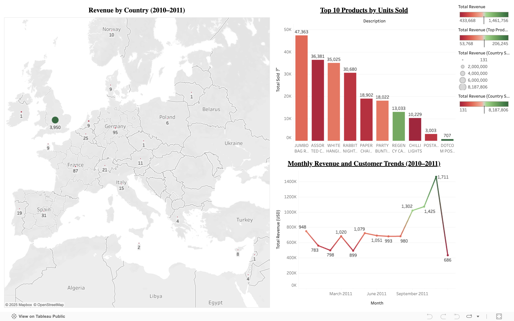

# Technical Projects

<nav class="projects-nav">
  <a href="#python-ml">Machine Learning & NLP Projects in Python</a>
  <a href="#r-ds">Data Science Projects in R</a>
  <a href="#viz">Data Visualization Projects</a>
  <a href="#portfolio">Technical Portfolio Website</a>
</nav>

---

## Machine Learning & NLP Projects in Python

### Eelectric Vehicle Charging Demand Estimator
**Tools:** Python, pandas, scikit-learn, Folium, Kepler.gl, matplotlib, seaborn, streamlit

**Skills Demonstrated:** Geospatial data aggregation & visualization, supervised machine learning (classification & regression), data cleaning & preprocessing, feature engineering from temporal and spatial EV data, interactive app development with Streamlit, model evaluation and metric interpretation.

  
<strong>Summary:</strong> 
  The EV Charging Demand Estimator is a data-driven tool designed to help policymakers and energy providers identify underserved areas for EV infrastructure expansion. Using publicly available EV population data, the project estimates where public charging stations are most needed across regions by analyzing EV density, vehicle type, and location-based demand signals.

  Two models were developed:
	<li>Classification model to label high/medium/low demand regions.</li>
	<li>Regression model to predict the expected number of EVs per region.</li>

Visual insights and model outputs were deployed through a user-friendly Streamlit app.
  

  
<strong>Key Insights:</strong>

  <ul>
    <li>Counties with high EV population growth often lack proportional charging infrastructure.</li>
    <li>Urban regions showed non-linear demand trends due to saturation and availability of home chargers.</li>
    <li>Certain suburban and rural counties were flagged as high-opportunity zones for new charging stations.</li>
  </ul>

  <table class="model-table">
  <thead>
    <tr>
      <th>Model Type</th>
      <th>Algorithm</th>
      <th>Accuracy / R²</th>
      <th>Key Metrics</th>
    </tr>
  </thead>
  <tbody>
    <tr>
      <td>Classification</td>
      <td>Random Forest Classifier</td>
      <td>0.79 (Accuracy)</td>
      <td>F1-score: 0.80</td>
    </tr>
    <tr>
      <td>Regression</td>
      <td>Random Forest Regressor</td>
      <td>0.89 (R^2 Score)</td>
      <td>RMSE: 0.54</td>
    </tr>
  </tbody>
</table>

<strong>Impact:</strong> 
  <li>Enables data-driven planning for EV infrastructure rollouts.</li>
  <li>Helps local governments and private investors prioritize regions with unmet charging needs.</li>
  <li>Encourages equitable access to EV charging across urban and rural areas.</li>
  <li>Supports sustainability goals by accelerating EV adoption through better infrastructure.</li>

📍[View Code](https://github.com/sowmyamaddali/ev-market-size-case-study/tree/main)

 

### Customer Churn Prediction
**Tools:** Python, pandas, scikit-learn, imbalanced-learn, seaborn, matplotlib  
**Skills Demonstrated:** EDA, feature engineering, class imbalance handling, model comparison, linear modeling, tree-based modeling, regularization, interpretability, business insight

  
<strong>Summary:</strong> 
  This project involved building an end-to-end machine learning pipeline to predict customer churn using the Telco dataset. The dataset contained information on 7,043 telecom customers in California, with features related to demographics, services used, and account activity. After exploratory analysis, the dataset was cleaned, transformed, and split into linear and tree-based model datasets. Class imbalance (~73% No Churn vs. ~27% Churn) was addressed using multiple resampling strategies, with SMOTE selected for its superior performance.
  

  
<strong>Key Insights:</strong>

  <ul>
    <li>Customers with month-to-month contracts, fiber optic internet, and low tenure were significantly more likely to churn.</li>
    <li>Senior citizens and users who paid via Bank Withdrawal were also at higher churn risk.</li>
    <li>Lasso Regression identified the most impactful features: satisfaction score, online security, phone service, and internet type.</li>
  </ul>

  
<strong>Model Performance Summary:</strong>

  <table class="model-table">
    <thead>
      <tr>
        <th>Model</th>
        <th>Accuracy</th>
        <th>Precision (Churn)</th>
        <th>Recall (Churn)</th>
        <th>ROC AUC</th>
      </tr>
    </thead>
    <tbody>
      <tr>
        <td>Logistic Regression</td>
        <td>93%</td>
        <td>0.87</td>
        <td>0.87</td>
        <td>0.97</td>
      </tr>
      <tr>
        <td>Ridge Classifier</td>
        <td>95%</td>
        <td>0.92</td>
        <td>0.87</td>
        <td>0.97</td>
      </tr>
      <tr>
        <td>Lasso Regression</td>
        <td>93%</td>
        <td>0.88</td>
        <td>0.86</td>
        <td>0.96</td>
      </tr>
      <tr>
        <td>Decision Tree</td>
        <td>95%</td>
        <td>0.90</td>
        <td>0.90</td>
        <td>0.93</td>
      </tr>
      <tr>
        <td>Random Forest</td>
        <td>95%</td>
        <td>0.98</td>
        <td>0.84</td>
        <td>0.98</td>
      </tr>
    </tbody>
  </table>

  
<strong>Impact:</strong> 
  The project highlights how machine learning models can help telecom providers predict and proactively manage customer churn. The final Random Forest model offered excellent precision and class separation, making it suitable for prioritizing high-risk customers and designing retention strategies.
  

📍 [View Code](https://github.com/sowmyamaddali/customer-churn-prediction)

 

### Breast Cancer - Survival Analysis & Predictive Modeling

**Tools:** Python, pandas, lifelines, scikit-learn, xgboost, keras, seaborn, matplotlib  
**Skills Demonstrated:** Survival analysis (Kaplan-Meier, Cox models), classification modeling, clustering, feature interpretation, medical data analysis

  
<strong>Summary:</strong> 
  This project applies survival analysis, machine learning, and unsupervised clustering to the Breast Cancer METABRIC dataset (2,000+ patients). The goal was to analyze patient survival patterns, predict high-risk individuals, and uncover hidden subgroups based on clinical and pathological features. The workflow included data preprocessing, EDA, Kaplan-Meier and Cox regression modeling, binary classification using Random Forest, XGBoost, and Neural Networks, and unsupervised clustering via K-Means.
  

  
<strong>Key Insights:</strong>

  <ul>
    <li>Random Forest and XGBoost models performed best with ROC-AUC scores of 0.79 and accuracy of 72%.</li>
    <li>Neural Networks improved overall accuracy to 74% but showed similar AUC (0.76), indicating marginal gains from deep learning.</li>
    <li>Top predictive features included Tumor Size, Nottingham Prognostic Index, and Age.</li>
    <li>Kaplan-Meier survival curves revealed significant survival differences across tumor stages and treatment types (e.g., hormone therapy).</li>
    <li>K-Means clustering identified 5 distinct patient subgroups with varying treatment patterns and survival outcomes; Cluster 0 showed the lowest survival probability, while Cluster 1 had the highest.</li>
  </ul>

  
<strong>Model Performance Comparison:</strong>

<table class="model-table">
  <thead>
    <tr>
      <th>Model</th>
      <th>Accuracy</th>
      <th>ROC-AUC</th>
      <th>Notable Strength</th>
    </tr>
  </thead>
  <tbody>
    <tr>
      <td>Random Forest</td>
      <td>72%</td>
      <td>0.79</td>
      <td>Balanced accuracy and interpretability</td>
    </tr>
    <tr>
      <td>XGBoost</td>
      <td>72%</td>
      <td>0.79</td>
      <td>Handles non-linearity and feature interactions well</td>
    </tr>
    <tr>
      <td>Neural Network (MLP)</td>
      <td>74%</td>
      <td>0.76</td>
      <td>Improved accuracy with deeper architecture</td>
    </tr>
    <tr>
      <td>Logistic Regression</td>
      <td>70%</td>
      <td>0.74</td>
      <td>Baseline interpretability and feature insights</td>
    </tr>
  </tbody>
</table>

<strong>Impact:</strong> 
This project demonstrates the integration of survival statistics, machine learning, and unsupervised clustering to derive actionable insights from clinical datasets. It supports the development of risk stratification tools and highlights the role of data science in precision oncology.
  

📍 [View Code](https://github.com/sowmyamaddali/Breast-Cancer-METABRIC)

 

### Revenue Prediction & Customer Analytics for Supermarkets

**Tools:** Python, pandas, scikit-learn, xgboost, keras, statsmodels, Streamlit  
**Skills Demonstrated:** Time series forecasting, regression modeling, deep learning, EDA, feature engineering, dashboard development, business analytics

  
<strong>Summary:</strong> 
  This end-to-end project forecasts next-day revenue across supermarket categories using sales data from five major UK retailers. The project includes extensive feature engineering (e.g., lag features, cyclical encodings, rolling statistics), EDA, and predictive modeling using machine learning, deep learning, and time series approaches. A Streamlit dashboard was also built to make insights and predictions accessible to non-technical users. The models were evaluated using MAE, RMSE, and R² metrics.
  

  
<strong>Key Insights:</strong>

  <ul>
    <li><strong>Random Forest</strong> delivered strong predictive performance with low MAE and RMSE, making it ideal for stable retail forecasting.</li>
    <li><strong>XGBoost</strong> achieved the highest R² score (0.91) and performed best overall, capturing complex interactions between price, product type, and time-based features.</li>
    <li><strong>LSTM</strong> models captured sequential sales trends but had higher variance, particularly on test data.</li>
    <li><strong>ARIMA</strong> was the weakest performer in this multivariate setting, confirming the advantages of machine learning in retail forecasting tasks.</li>
  </ul>

  
<strong>Model Performance Comparison:</strong>

  <table class="model-table">
    <thead>
      <tr>
        <th>Model</th>
        <th>R² (Test)</th>
        <th>MAE (Test)</th>
        <th>RMSE (Test)</th>
      </tr>
    </thead>
    <tbody>
      <tr>
        <td>Linear Regression</td>
        <td>0.85</td>
        <td>5.37</td>
        <td>15.78</td>
      </tr>
      <tr>
        <td>Random Forest</td>
        <td>0.90</td>
        <td>2.39</td>
        <td>11.08</td>
      </tr>
      <tr>
        <td>XGBoost</td>
        <td>0.91</td>
        <td>3.76</td>
        <td>13.55</td>
      </tr>
      <tr>
        <td>ANN</td>
        <td>0.90</td>
        <td>3.60</td>
        <td>11.68</td>
      </tr>
      <tr>
        <td>LSTM</td>
        <td>0.85</td>
        <td>5.17</td>
        <td>16.43</td>
      </tr>
      <tr>
        <td>ARIMA</td>
        <td>0.67</td>
        <td>6.40</td>
        <td>7.40</td>
      </tr>
    </tbody>
  </table>

  
<strong>Impact:</strong> 
  This project provides a practical framework for retail revenue forecasting using interpretable and high-performing models. The results can help supermarkets reduce inventory waste, improve pricing decisions, and optimize daily operations. The accompanying Streamlit app empowers stakeholders to explore trends, compare product pricing, and visualize performance across brands and categories.
  

📍 [View Code](https://github.com/sowmyamaddali/Revenue-Prediction-Customer-Analytics-for-Supermarket-Data/tree/main)

 

## Data Science Projects in R

### Macroeconomic Forecasting with VAR Models in R

**Tools:** R, vars, urca, dplyr, ggplot2  
**Skills Demonstrated:** Time series stationarity analysis, ARIMA modeling, VAR modeling, cointegration testing, impulse response analysis, forecast error variance decomposition, data visualization

  
<strong>Summary:</strong> 
  This project applies time series forecasting techniques in R to analyze and predict movements in four key macroeconomic indicators: the Consumer Price Index (CPI), Producer Price Index (PPI), PPI for Finished Goods (PPIFG), and PPI for Finished Consumer Foods (PPIFCF). The analysis involved testing for stationarity and cointegration, fitting ARIMA and Vector Autoregressive (VAR) models, and evaluating model performance using forecast error metrics (MSE, MAE). Impulse response functions and forecast error variance decomposition (FEVD) were used to analyze interdependencies and the effects of shocks on each series.
  

  
<strong>Key Insights:</strong>

  <ul>
    <li>All four series were found to be integrated of order one (I(1)), requiring first differencing for stationarity.</li>
    <li>Optimal lag lengths for VAR models were determined using AIC, with VAR(6) providing the best forecasting performance overall.</li>
    <li>Impulse response analysis showed CPI was significantly influenced by lagged values of PPI and PPIFG, while PPI responded to shocks in CPI and PPIFG with lagged, oscillating behavior.</li>
    <li>FEVD analysis confirmed CPI’s dominance in explaining its own forecast variance and PPI’s high sensitivity to CPI innovations.</li>
  </ul>

  
<strong>Model Performance Comparison (Forecasting Accuracy):</strong>

<table class="model-table">
  <thead>
    <tr>
      <th>Model</th>
      <th>Variable</th>
      <th>MSE</th>
      <th>MAE</th>
    </tr>
  </thead>
  <tbody>
    <tr>
      <td>VAR(6)</td>
      <td>CPI</td>
      <td>0.145</td>
      <td>0.304</td>
    </tr>
    <tr>
      <td>VAR(6)</td>
      <td>PPI</td>
      <td>1.820</td>
      <td>1.107</td>
    </tr>
    <tr>
      <td>VAR(6)</td>
      <td>PPIFG</td>
      <td>1.116</td>
      <td>0.935</td>
    </tr>
    <tr>
      <td>VAR(6)</td>
      <td>PPIFCF</td>
      <td>2.377</td>
      <td>1.356</td>
    </tr>
    <tr>
      <td>VAR(2)</td>
      <td>CPI</td>
      <td>0.313</td>
      <td>0.494</td>
    </tr>
    <tr>
      <td>VAR(2)</td>
      <td>PPI</td>
      <td>1.089</td>
      <td>0.819</td>
    </tr>
    <tr>
      <td>VAR(2)</td>
      <td>PPIFG</td>
      <td>1.105</td>
      <td>0.927</td>
    </tr>
    <tr>
      <td>VAR(2)</td>
      <td>PPIFCF</td>
      <td>2.339</td>
      <td>1.113</td>
    </tr>
    <tr>
      <td>VAR(1)</td>
      <td>CPI</td>
      <td>0.137</td>
      <td>0.311</td>
    </tr>
    <tr>
      <td>VAR(1)</td>
      <td>PPI</td>
      <td>1.253</td>
      <td>0.882</td>
    </tr>
    <tr>
      <td>VAR(1)</td>
      <td>PPIFG</td>
      <td>0.988</td>
      <td>0.896</td>
    </tr>
    <tr>
      <td>VAR(1)</td>
      <td>PPIFCF</td>
      <td>2.002</td>
      <td>1.058</td>
    </tr>
  </tbody>
</table>

<strong>Impact:</strong> 
  This project demonstrates the power of multivariate time series models in capturing macroeconomic relationships and forecasting inflation-related indices. It also shows the importance of model selection, diagnostics, and interpretability in economic forecasting. The results have implications for central banks, policy analysts, and economists interested in inflation dynamics and inter-market linkages.
  

📍 [View Code](https://github.com/sowmyamaddali/Analyzing-Macroeconomic-Trends)

 

### Brain Stroke Prediction

**Tools:** R, dplyr, ggplot2, ROSE, caret  
**Skills Demonstrated:** Data cleaning, class imbalance handling, model comparison, feature importance analysis, binary classification

  
<strong>Summary:</strong> 
  This R-based project focuses on predicting the likelihood of a stroke in patients using demographic and health-related data. The dataset contains 5,110 records and 12 features, including age, glucose levels, BMI, and smoking status. Preprocessing involved handling 210 missing values, encoding categorical variables, and normalizing continuous features. Multiple classification algorithms were used to assess model performance, including logistic regression, decision trees, and random forest classifiers.
  

  
<strong>Key Insights:</strong>

  <ul>
    <li>Initial model performance was hindered by class imbalance, prompting the use of ROSE and a combined under/over sampling strategy for rebalancing.</li>
    <li>Random Forest consistently outperformed Logistic Regression and Decision Tree classifiers under both sampling strategies.</li>
    <li>Feature importance plots from Random Forest highlighted age, glucose level, and hypertension as key predictors of stroke risk.</li>
  </ul>

  
<strong>Model Performance Comparison:</strong>

  <table class="model-table">
    <thead>
      <tr>
        <th>Sampling Technique</th>
        <th>Model</th>
        <th>Accuracy</th>
        <th>Recall</th>
        <th>AUC Score</th>
      </tr>
    </thead>
    <tbody>
      <tr>
        <td>ROSE</td>
        <td>Random Forest (no feature selection)</td>
        <td>0.78</td>
        <td>0.79</td>
        <td>0.794</td>
      </tr>
      <tr>
        <td>Under + Over Sampling</td>
        <td>Random Forest (no feature selection)</td>
        <td>0.916</td>
        <td>0.94</td>
        <td>0.84</td>
      </tr>
    </tbody>
  </table>

  
<strong>Impact:</strong> 
  This project demonstrates how machine learning can support early detection of stroke risk factors using health and lifestyle data. It highlights the role of sampling techniques in improving model performance and reinforces the importance of data-driven tools in public health prediction and prevention efforts.
  

📍 [View Code](https://github.com/sowmyamaddali/DATS6101_Project_Team_Sage)

 

## Data Visualization Projects

### E-Commerce Analytics Dashboard (UK Retail Sales)

**Tools:** dbt, DuckDB, Python, Tableau

**Skills Demonstrated:** Data modeling, SQL transformations, dashboard design, KPI tracking, end-to-end data pipeline development

 
  
<strong>Summary:</strong>  This project demonstrates a complete analytics workflow starting from raw transactional data to an interactive dashboard. Using a UK-based e-commerce dataset (2010–2011), I modeled and transformed the data using dbt and DuckDB, queried the final tables using Python, and visualized insights in Tableau Public. 
  

  
<strong>Key Insights:</strong>
 
  <ul> 
    <li>Revenue peaked in November–December, revealing strong seasonal trends.</li> 
    <li>Top products included gift sets and vintage items with high repeat purchases.</li> 
    <li>The UK dominated revenue generation, followed by the Netherlands and Germany.</li> <li>Customer segmentation showed a small group of high-value buyers contributing disproportionately to sales.</li> 
  </ul>

  
<strong>Impact:</strong>  
    This dashboard supports retail decision-making by tracking KPIs like monthly revenue, top-performing products, customer behavior, and geographic distribution. It reflects the real-world utility of data modeling tools like dbt combined with storytelling through Tableau. 
  
 

📍 [View interactive dashboard on Tableau Public](https://public.tableau.com/views/E-CommerceSalesDashboard_17450876728310/Dashboard1?:language=en-US&:sid=&:redirect=auth&:display_count=n&:origin=viz_share_link)

 

### Virginia Air Quality Dashboard

**Tools:**  Excel, Tableau

**Skills Demonstrated:** Data cleaning, visualization design, public health analysis, storytelling

  
<strong>Summary:</strong> 
  Built an interactive Tableau dashboard to analyze PM2.5 pollution levels across Virginia using data from the EPA. The dashboard visualizes daily, weekly, and county-level air quality trends, making it easier for policymakers and the public to identify pollution spikes and geographic hotspots.
  

  
<strong>Key Insights:</strong>

  <ul>
    <li>Identified consistent midweek spikes in PM2.5 pollution across multiple counties.</li>
    <li>Found higher pollution levels in urban counties compared to rural areas.</li>
    <li>Enabled interactive exploration of air quality trends by time period and location.</li>
  </ul>

  
<strong>Impact:</strong> 
  The dashboard improves public awareness and supports data-driven decisions in environmental planning and health policy.
  

📍 [View interactive dashboard on Tableau Public](https://public.tableau.com/views/air_quality_workbook_dashboard/VirginiaAirQualityAnalysis2023?:language=en-US&:sid=&:redirect=auth&:display_count=n&:origin=viz_share_link)

 

### Measles & Rubella Immunization Activities

**Tools:** Excel, Tableau  
**Skills Demonstrated:** Data preprocessing, trend analysis, interactive dashboard design, public health visualization

  
<strong>Summary:</strong> 
  Built an interactive Tableau dashboard to explore global measles and rubella immunization efforts from 2000 to 2024. The dashboard visualizes coverage trends, regional disparities, and campaign timelines using various interactive charts.
  

  
<strong>Key Insights:</strong>

  <ul>
    <li>Highlighted regions with consistently suboptimal immunization coverage, guiding targeted public health interventions.</li>
    <li>Identified temporal trends in vaccination effectiveness across intervention types and WHO regions.</li>
    <li>Enabled dynamic data exploration through filters and visual drill-downs, improving accessibility and usability of global immunization data.</li>
  </ul>

  
<strong>Impact:</strong> 
  The dashboard empowers public health organizations and planners to make informed, data-driven decisions by identifying at-risk populations and optimizing future immunization strategies.
  

📍 [View interactive dashboard on Tableau Public](https://public.tableau.com/views/Immunization-Activities/Dashboard1?:language=en-US&:sid=&:redirect=auth&:display_count=n&:origin=viz_share_link)

 

### Visualizing the History of Global Nuclear Tests (1945–1998)
**Tools:** R, ggplot2, dplyr, lubridate, sf  
**Skills Demonstrated:** Data wrangling, geospatial visualization, time series analysis, historical trend analysis, public data storytelling

  
<strong>Summary:</strong> 
  This data visualization project explores the global history of nuclear testing from 1945 to 1998, focusing on tests conducted by the United States and the Soviet Union. Using R, the analysis covers detailed attributes such as geographic location, type, depth, and estimated yield of each test, along with its purpose and responsible organization. The visualizations highlight the escalation of nuclear activity during the Cold War and provide historical context to global arms development and policy shifts.
  

  
<strong>Key Insights:</strong>

  <ul>
    <li>Revealed a concentration of nuclear tests during peak Cold War periods, particularly by the U.S. and USSR between the 1950s and 1980s.</li>
    <li>Identified geographic clustering of test sites (e.g., Nevada and Semipalatinsk), shedding light on strategic testing zones.</li>
    <li>Showed changes in testing methods over time, with shifts from atmospheric to underground testing aligned with evolving international treaties.</li>
  </ul>

  
<strong>Impact:</strong> 
  The project provides a historical lens through which researchers, historians, and the public can explore the scale, timing, and geopolitical implications of nuclear weapons testing. It enhances understanding of 20th-century military history through accessible and data-driven visuals.
  

📍 [View Code](https://github.com/sowmyamaddali/Visualizing-Nuclear-Explosions)

 

## Technical Portfolio Website

**Tools:** GitHub Pages, Jekyll, SCSS, Markdown, HTML  
**Skills Demonstrated:** Static site generation, technical writing, UI customization, documentation, Git-based version control

  
<strong>Summary:</strong> 
  This portfolio website was built using Jekyll and GitHub Pages as a fully customizable static site. It showcases technical projects across data science, machine learning, and analytics, while also demonstrating front-end development skills through custom styling and layout design. Core pages such as <code>index.md</code> and <code>experience.md</code> were created and managed directly using Markdown and HTML.
  

  
<strong>Key Features:</strong>

  <ul>
    <li>Structured navigation for Data Visualization, Machine Learning, NLP, R Projects, and Time Series sections.</li>
    <li>Customized layout based on Jekyll's Slate theme, extended with personalized SCSS styling.</li>
    <li>Responsive images and justified content layout for a clean, professional appearance.</li>
    <li>Interactive buttons linking between internal project pages.</li>
    <li>Uniform styling across project entries using HTML-based tables and consistent formatting across Markdown files like <code>index.md</code> and <code>experience.md</code>.</li>
  </ul>

  
<strong>Impact:</strong> 
  This site not only presents project work but serves as a technical artifact in itself — demonstrating end-to-end static site development, version control, layout design, and content management for professional documentation and portfolio presentation.
  

 

[Home](./)
