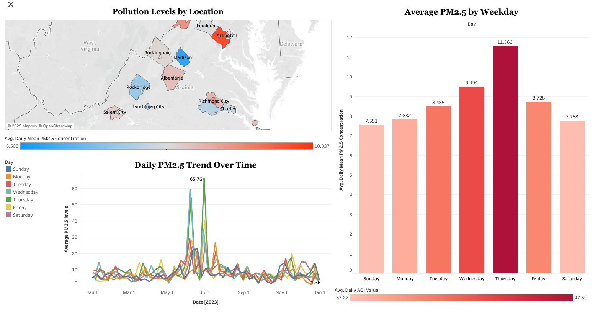
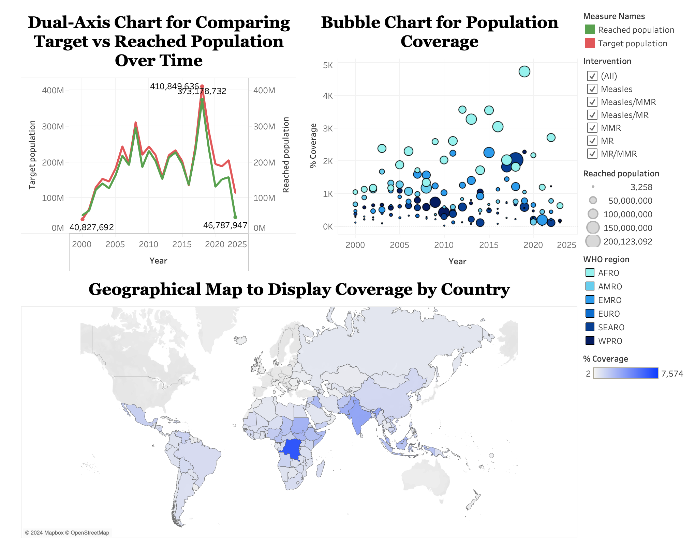
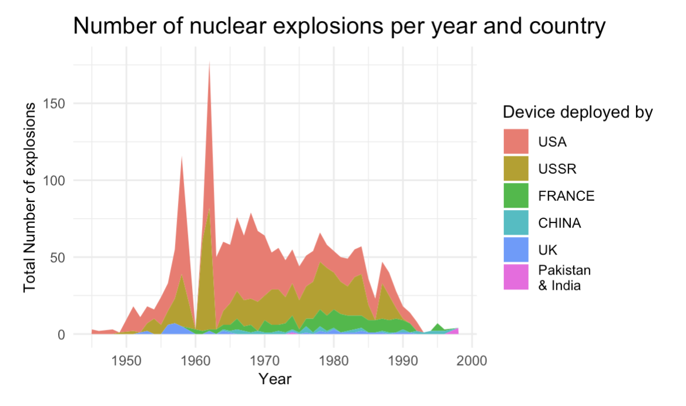

# Technical Projects

<nav class="projects-nav">
  <a href="#python-ml">Python & Machine Learning</a>
  <a href="#r-ml">R & Machine Learning</a>
  <a href="#viz">Tableau Dashboards</a>
  <a href="#portfolio">Portfolio Website</a>
</nav>

---

## Python & Machine Learning

## R & Machine Learning

## Data Visualization Projects

### Virginia Air Quality Dashboard

**Tools:** Excel, Tableau

**Skills Demonstrated:** Data cleaning, visualization design, public health analysis, storytelling

  
<strong>Summary:</strong> 
  Built an interactive Tableau dashboard to analyze PM2.5 pollution levels across Virginia using data from the EPA. The dashboard visualizes daily, weekly, and county-level air quality trends, making it easier for policymakers and the public to identify pollution spikes and geographic hotspots.
  

  
<strong>Key Insights:</strong>

  <ul>
    <li>Identified consistent midweek spikes in PM2.5 pollution across multiple counties.</li>
    <li>Found higher pollution levels in urban counties compared to rural areas.</li>
    <li>Enabled interactive exploration of air quality trends by time period and location.</li>
  </ul>

  
<strong>Impact:</strong> 
  The dashboard improves public awareness and supports data-driven decisions in environmental planning and health policy.
  

📍 [View interactive dashboard on Tableau Public](https://public.tableau.com/views/air_quality_workbook_dashboard/VirginiaAirQualityAnalysis2023?:language=en-US&:sid=&:redirect=auth&:display_count=n&:origin=viz_share_link)

 

### Measles & Rubella Immunization Activities

**Tools:** Excel, Tableau  
**Skills Demonstrated:** Data preprocessing, trend analysis, interactive dashboard design, public health visualization

  
<strong>Summary:</strong> 
  Built an interactive Tableau dashboard to explore global measles and rubella immunization efforts from 2000 to 2024. The dashboard visualizes coverage trends, regional disparities, and campaign timelines using various interactive charts.
  

  
<strong>Key Insights:</strong>

  <ul>
    <li>Highlighted regions with consistently suboptimal immunization coverage, guiding targeted public health interventions.</li>
    <li>Identified temporal trends in vaccination effectiveness across intervention types and WHO regions.</li>
    <li>Enabled dynamic data exploration through filters and visual drill-downs, improving accessibility and usability of global immunization data.</li>
  </ul>

  
<strong>Impact:</strong> 
  The dashboard empowers public health organizations and planners to make informed, data-driven decisions by identifying at-risk populations and optimizing future immunization strategies.
  

📍 [View interactive dashboard on Tableau Public](https://public.tableau.com/views/Immunization-Activities/Dashboard1?:language=en-US&:sid=&:redirect=auth&:display_count=n&:origin=viz_share_link)

 

### Visualizing the History of Global Nuclear Tests (1945–1998)
**Tools:** R, ggplot2, dplyr, lubridate, sf  
**Skills Demonstrated:** Data wrangling, geospatial visualization, time series analysis, historical trend analysis, public data storytelling

  
<strong>Summary:</strong> 
  This data visualization project explores the global history of nuclear testing from 1945 to 1998, focusing on tests conducted by the United States and the Soviet Union. Using R, the analysis covers detailed attributes such as geographic location, type, depth, and estimated yield of each test, along with its purpose and responsible organization. The visualizations highlight the escalation of nuclear activity during the Cold War and provide historical context to global arms development and policy shifts.
  

  
<strong>Key Insights:</strong>

  <ul>
    <li>Revealed a concentration of nuclear tests during peak Cold War periods, particularly by the U.S. and USSR between the 1950s and 1980s.</li>
    <li>Identified geographic clustering of test sites (e.g., Nevada and Semipalatinsk), shedding light on strategic testing zones.</li>
    <li>Showed changes in testing methods over time, with shifts from atmospheric to underground testing aligned with evolving international treaties.</li>
  </ul>

  
<strong>Impact:</strong> 
  The project provides a historical lens through which researchers, historians, and the public can explore the scale, timing, and geopolitical implications of nuclear weapons testing. It enhances understanding of 20th-century military history through accessible and data-driven visuals.
  

 

## Portfolio Website

[Home](./)
